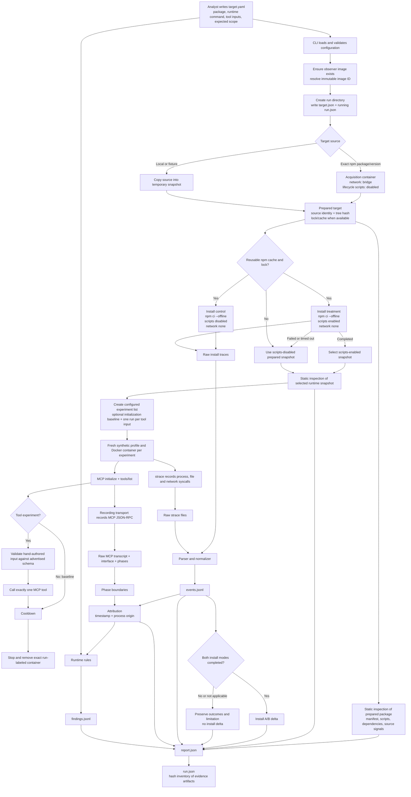

# Core detonation flow

This diagram covers `forge analyze`. The separate `forge agent-evaluate` path
is documented in `AgentRolloutV1.md`.

```mermaid
flowchart TD
    A["Analyst writes target.yaml<br/>package, runtime command, tool inputs, expected scope"]
    A --> B["CLI loads and validates configuration"]
    B --> B1["Ensure observer image exists<br/>resolve immutable image ID"]
    B1 --> C["Create run directory<br/>write target.json + running run.json"]
    C --> D{"Target source"}

    D -->|"Exact npm package/version"| E["Acquisition container<br/>network: bridge<br/>lifecycle scripts: disabled"]
    D -->|"Local or fixture"| F["Copy source into temporary snapshot"]
    E --> G["Prepared target<br/>source identity + tree hash<br/>lock/cache when available"]
    F --> G

    G --> H["Static inspection of prepared package<br/>manifest, scripts, dependencies, source signals"]

    G --> I{"Reusable npm cache and lock?"}
    I -->|"Yes"| J1["Install control<br/>npm ci --offline<br/>scripts disabled<br/>network none"]
    I -->|"Yes"| J2["Install treatment<br/>npm ci --offline<br/>scripts enabled<br/>network none"]
    J1 --> K["Raw install traces"]
    J2 --> K
    K --> AB
    J2 -->|"Completed"| M["Select scripts-enabled snapshot"]
    J2 -->|"Failed or timed out"| N["Use scripts-disabled prepared snapshot"]
    I -->|"No"| N

    M --> O["Static inspection of selected runtime snapshot"]
    N --> O

    O --> P["Create configured experiment list<br/>optional initialization baseline + one run per tool input"]
    P --> Q["Fresh synthetic profile and Docker container per experiment"]
    Q --> R["MCP initialize + tools/list"]
    R --> S{"Tool experiment?"}
    S -->|"No: baseline"| T["Cooldown"]
    S -->|"Yes"| U["Validate hand-authored input against advertised schema"]
    U --> V["Call exactly one MCP tool"]
    V --> T

    Q --> W["strace records process, file and network syscalls"]
    R --> X["Recording transport records MCP JSON-RPC"]
    T --> Y["Stop and remove exact run-labeled container"]

    W --> Z["Raw strace files"]
    X --> AA["Raw MCP transcript + interface + phases"]
    Z --> AB["Parser and normalizer"]
    AB --> AC["events.jsonl"]
    AA --> AD["Phase boundaries"]

    AC --> AE["Attribution<br/>timestamp + process origin"]
    AD --> AE

    AC --> AF{"Both install modes completed?"}
    AF -->|"Yes"| AF1["Install A/B delta"]
    AF -->|"No or not applicable"| AF2["Preserve outcomes and limitation<br/>no install delta"]
    AE --> AG["Runtime rules"]
    A --> AG
    AG --> AH["findings.jsonl"]

    H --> AI["report.json"]
    O --> AI
    AF1 --> AI
    AF2 --> AI
    AC --> AI
    AE --> AI
    AH --> AI
    AI --> AJ["run.json<br/>hash inventory of evidence artifacts"]
```
